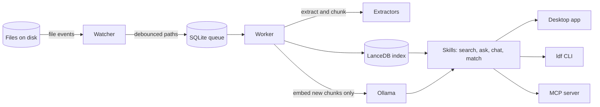

# LocalDoc Finder developer guide

This guide takes you from a clean Windows machine to a running app, a green test suite and a signed-off installer build. For a shorter introduction to the workflow, start with [CONTRIBUTING.md](../CONTRIBUTING.md).

## Contents

1. [Overview](#1-overview)
2. [Prerequisites](#2-prerequisites)
3. [Getting the code](#3-getting-the-code)
4. [Running from source](#4-running-from-source)
5. [Architecture](#5-architecture)
6. [Configuration](#6-configuration)
7. [Design principles](#7-design-principles)
8. [Development workflow](#8-development-workflow)
9. [Evaluating embedding models](#9-evaluating-embedding-models)
10. [Building the installer](#10-building-the-installer)
11. [Releasing](#11-releasing)
12. [Troubleshooting](#12-troubleshooting)

---

## 1. Overview

LocalDoc Finder is a Windows desktop app that indexes a user's files into a local vector database and serves semantic search, cited answers, chat and document matching over them. Models run locally through [Ollama](https://ollama.com). Cloud models are optional and always receive masked text.

| Component | Technology |
| --- | --- |
| Desktop UI | PySide6 (Qt 6): tray app, hotkey popup, Settings window, setup wizard |
| Index | LanceDB (vectors and full text), SQLite (work queue, manifest, metadata) |
| Models | Ollama: an embedding model for search, an optional chat model for Ask, Chat and Match |
| Extraction | PyMuPDF, python-docx, python-pptx, tree-sitter, a built-in RTF reader, Windows OCR (`Windows.Media.Ocr`) |
| Packaging | PyInstaller (one-folder build) and Velopack (installer, delta updates) |
| Tooling | uv, ruff, mypy (strict), pytest, pre-commit, GitHub Actions |

## 2. Prerequisites

| Tool | Why | Notes |
| --- | --- | --- |
| Windows 10 or 11, 64-bit | The app uses Windows APIs: OCR, global hotkey, Task Scheduler, Credential Manager | |
| Python 3.11+ | `requires-python = ">=3.11"`; `.python-version` pins the version used in CI | uv installs it for you |
| [uv](https://docs.astral.sh/uv/) | Dependency manager; reads `uv.lock` | |
| [Ollama](https://ollama.com/download) | Serves the models on `127.0.0.1:11434` | |
| Git | | |
| .NET 8 SDK | Only to build the installer (`vpk`) | End users need nothing |

**Hardware.** Any 64-bit PC with 4 GB of RAM runs search. An NVIDIA GPU is detected through NVML and used automatically; without one, model choice falls back to CPU-friendly models sized to half of system RAM (`core/models/fit.py`). AMD and Intel GPUs are treated as "no GPU", which is always safe.

## 3. Getting the code

```powershell
git clone https://github.com/HarshaReddyVardhan/LocalDocFinder.git
cd LocalDocFinder
uv sync                                  # creates .venv from uv.lock (runtime + dev groups)
.venv\Scripts\pre-commit install
ollama pull qwen3-embedding:0.6b         # search model (required for indexing and search)
ollama pull llama3.2                     # chat model, only for Ask, Chat and Match
.venv\Scripts\ldf doctor                 # checks Python, Ollama, models, OCR, extractors, settings
```

Fix every `[fail]` that `ldf doctor` reports before continuing. `ldf setup --dry-run` shows which models first-run setup would pick for your hardware.

Never install into the global interpreter. Always work inside `.venv`.

## 4. Running from source

### 4.1 Command line (`ldf`)

```powershell
.venv\Scripts\ldf index --now --path D:\Projects\myapp     # index a folder now
.venv\Scripts\ldf status                                    # index and queue state
.venv\Scripts\ldf search "where do we retry failed payments"
.venv\Scripts\ldf search "charge_card type:code proj:billing after:2026-01"
.venv\Scripts\ldf ask "how does the retry logic work?"
.venv\Scripts\ldf health                                    # queue, VRAM, loaded models, cloud spend
```

Search filters: `type:img|code|doc|plan|memory|note|pdf`, `ext:py`, `proj:name`, `in:D:\path`, `after:2026-01`, `before:2026-06`.

`ldf --help` and `ldf <command> --help` list everything. The skill commands (`search`, `ask`, `chat`, `match`) are generated from the skill registry. Global flags: `--data-dir <dir>` overrides the data folder; `--cloud-ok` lets one command send masked text to the configured cloud provider.

### 4.2 Desktop app

Run these from the repository root with Ollama running. Nothing needs to be built or installed.

```powershell
.venv\Scripts\python -m localdoc_finder app --show     # tray app with the popup open (best while developing)
.venv\Scripts\python -m localdoc_finder app            # tray icon only; press the hotkey to open the popup
.venv\Scripts\python -m localdoc_finder setup          # run the setup wizard now (same as app --setup)
.venv\Scripts\pythonw -m localdoc_finder app           # no console window, like a real launch
```

What you get:

- **Tray icon** (magnifier on a blue tile). Left-click opens the popup. The right-click menu has Search, Settings, Run setup again, Restart to update and Quit.
- **Ctrl+Alt+Space** opens the popup from anywhere. If another app owns that key, the tray tooltip says the hotkey is unavailable; change it in Settings.
- **Popup keys:** type to search. Enter opens the file, Ctrl+Enter reveals it in Explorer, Shift+Enter opens it in VS Code, Tab switches mode, Esc hides it.
- **Settings window:** General (folders and file types, hotkey, theme), Indexing (progress, pause and resume), Features, Models & Health, Cloud & Privacy, Updates, Advanced (generated from the settings schema) and About.
- **First launch** runs the setup wizard automatically when no completed setup is recorded in the data folder.

### 4.3 Background processes

```powershell
.venv\Scripts\python -m localdoc_finder watcher     # watches folders and queues changes (always on, light)
.venv\Scripts\python -m localdoc_finder worker      # drains the queue: extract, embed, write to LanceDB
.venv\Scripts\ldf autostart on                      # watcher and tray at logon (off removes them)
```

`python -m localdoc_finder <app|watcher|worker|setup>` is the single dispatcher; the frozen `LocalDocFinder.exe` takes the same arguments. To start one of our own processes from code, use `core.process.self_command`. From source, the app does not start the watcher for you; run it in a second terminal or index on demand with `ldf index --now`.

### 4.4 MCP server

```powershell
claude mcp add localdoc-finder -- D:\Projects\LocalDocFinder\.venv\Scripts\ldf.exe mcp
```

`ldf mcp` serves read-only `search`, `ask` and `match` tools over stdio. Results are treated as outbound: secrets are left out, government and financial IDs are masked, and `ask` and `match` only use local models.

### 4.5 Tips for a smooth dev loop

1. **Use a scratch data folder** so your real index and settings stay untouched:
   ```powershell
   $env:LDF_STORAGE__DATA_DIR = "D:\scratch\ldf-data"
   ```
   Set it in every terminal that runs the app, watcher, worker or `ldf`, or pass `ldf --data-dir`.
2. **Quit from the tray, not with Ctrl+C.** Closing the window only hides it; Quit unloads the models.
3. **One copy per data folder.** A file lock (`app.lock`) makes a second launch exit quietly. Quit any installed `LocalDocFinder.exe` that uses the same folder.
4. **Restart after Python changes.** There is no hot reload. Settings changes made in the Settings window apply immediately.
5. **Debug output:** run with `python` rather than `pythonw`, set `LDF_LOG_LEVEL=DEBUG`, and read the JSON logs in `<data folder>\logs`.
6. **Qt needs a desktop session.** The app cannot run over SSH or as a service.

## 5. Architecture



- The **watcher** is always on and light. It records changes, and starts the worker only when the PC is on AC power, settled and idle.
- The **worker** hashes each file, extracts only what changed, embeds new chunks in batches, writes them to LanceDB, and unloads the model. It checks the power and idle gates before every batch.
- **Skills** query the index. Front-ends (app, CLI, MCP) only collect input and display results.

### 5.1 Project layout

```text
src/localdoc_finder/
  __main__.py      dispatcher (app | watcher | worker | setup)
  cli.py           the ldf command (thin)
  mcp_server.py    ldf mcp (thin)
  watcher.py       file events -> SQLite queue
  worker.py        queue -> extract -> embed -> LanceDB
  app/             PySide6: popup, Settings window, setup wizard, update scheduler
  core/            all logic; no UI imports
    extractors/    one module per format, registered with @register_extractor
    skills/        search, ask, chat, match (registered with @register)
    doctypes/ sources/ providers/ privacy/ match/ models/ setup/ store/
    settings.py scope.py file_kinds.py power.py secrets.py rag.py retrieval.py hooks.py ...
tests/             mirrors the package; shared fixtures in tests/core/conftest.py and fakes.py
eval/              queries for ldf eval (comparing embedding models)
packaging/         PyInstaller spec, entry points, icon generator
scripts/           build.ps1, install.ps1, install_task.ps1, sandbox/
```

### 5.2 What gets indexed

Scope is decided in `core/scope.py` (`ScopePolicy.is_valid_file`), cheapest check first, and the secrets denylist always runs first. Users choose **where** (the whole PC or chosen folders) and **which kinds of file**:

| Kind (`FileKind`) | Extensions (`ScopeSettings.kind_exts`) | Extractor |
| --- | --- | --- |
| `documents` | `.pdf .docx .pptx .rtf` | `pdf`, `docx`, `pptx`, `rtf` |
| `notes` | `.txt .md .markdown .mdc .tex` | `markdown`, `text` |
| `images` | `.png .jpg .jpeg .webp .bmp .tif .tiff .svg` | `image`, `svg` |
| `code` | 40+ languages, plus `Dockerfile`, `Makefile` and similar names | `code` (tree-sitter), `notebook`, `text` |
| `data` | `.json .yaml .yml .toml .xml .ini .cfg .sql .csv .tsv` | `text` |

`scope.file_types` is a preset (`documents`, `everything`) or `custom`, in which case `scope.custom_kinds` lists the kinds. Presets are defined once in `core/file_kinds.py`. A test checks that every offered extension has an extractor.

**Scanned material.** PDF pages with almost no text but a picture (inline images included) are rendered at 200 DPI and read with Windows OCR, up to `images.max_scanned_pages` pages per document. Multi-page TIFF scans are read page by page. Pictures inside PDF, Word, PowerPoint and RTF files are OCR'd up to `images.max_per_doc` per document, each distinct picture once.

### 5.3 Hardware and model selection

`core/models/hardware.py` probes the GPU, RAM and power source; every probe degrades gracefully. `core/models/fit.py` sets the memory budget (VRAM with a GPU, half of RAM without) and admits only catalog models flagged `cpu_ok` on CPU-only machines. `core/models/starter.py` picks the first preferred model per role that fits:

| Machine | Search model | Chat model (optional features) |
| --- | --- | --- |
| No GPU, 4 GB RAM | `nomic-embed-text` | none offered |
| No GPU, 8 GB+ RAM | `qwen3-embedding:0.6b` | `llama3.2` |
| NVIDIA, 4 GB VRAM | `qwen3-embedding:0.6b` | `llama3.2` |
| NVIDIA, 8 GB+ VRAM | `qwen3-embedding:0.6b` | `qwen3.5:9b` |

The catalog lives in `core/models/models_catalog.toml`.

## 6. Configuration

- **Data folder:** `%LOCALAPPDATA%\LocalDocFinderData` holds the index, the SQLite queue, logs and `settings.toml`. The install folder (`%LOCALAPPDATA%\LocalDocFinder`) is separate, so uninstalling keeps user data. Data from releases named Vector Embed is moved here on first start (`core/data_migration.py`).
- **`settings.toml`** is validated at startup with pydantic-settings, and invalid settings stop the app with a clear message. Files carry a `schema_version` and are migrated forward (`MIGRATIONS` in `core/settings.py`).
- **Environment variables** override the file. They use the prefix `LDF_`, with nested keys joined by `__`. Copy [.env.example](../.env.example) to `.env` **in the data folder** to set them locally; a `.env` anywhere else is ignored.

| Variable | Meaning |
| --- | --- |
| `LDF_LOG_LEVEL` | Logging level |
| `LDF_OLLAMA_HOST` | Ollama URL |
| `LDF_STORAGE__DATA_DIR` | Use a different data folder |
| `LDF_POWER__REQUIRE_AC_POWER` | Gate indexing on AC power (turn off only for local debugging) |
| `LDF_UPDATES__AUTO_CHECK`, `LDF_UPDATES__REPO_URL` | Update checks and their source |
| `LDF_APP__START_WITH_WINDOWS` | Start at logon |

API keys for cloud providers are stored in Windows Credential Manager through `keyring`, never in files. Manage them with `ldf keys` and `ldf cloud`.

## 7. Design principles

These invariants come from the product's promises to users. Changes that break them are not merged.

| Invariant | Why |
| --- | --- |
| Indexing never runs on battery; models are unloaded after work | The app must be invisible on a laptop |
| The embedder and the chat model are never on the GPU together | Fits 4–8 GB cards without out-of-memory errors |
| Secrets are never indexed or sent to a cloud provider; government and financial IDs are always masked before any cloud call | Privacy cannot depend on configuration |
| `core/` has no UI imports; front-ends are thin | One tested engine serves the app, CLI and MCP |
| Extend through registries (`@register`), not core switch statements | New formats, providers and skills are a single new file |

The full rules are in [.claude/rules/design-principles.md](../.claude/rules/design-principles.md) and [.claude/rules/python-standards.md](../.claude/rules/python-standards.md).

## 8. Development workflow

### 8.1 Checks

```powershell
.venv\Scripts\ruff format . ; .venv\Scripts\ruff check . --fix
.venv\Scripts\mypy                                          # strict, on src/
.venv\Scripts\python -m pytest                              # tests with coverage (floor 80%)
.venv\Scripts\pre-commit run --all-files
```

CI (`.github/workflows/ci.yml`) runs the same checks plus `pip-audit` on every push to `main` and every pull request.

### 8.2 Testing conventions

1. Tests are offline and deterministic. Ollama, HTTP, Windows APIs, `psutil` and NVML are faked. Real-model tests carry `@pytest.mark.ollama` and skip when the model is absent.
2. Use `tmp_path`, never the real home folder or `%LOCALAPPDATA%`. pytest's `tmp_path` sits under `AppData`, which the scope rules block, so scope-sensitive tests use the `scope_settings` fixture.
3. Every bug fix starts with a failing regression test.
4. Type hints everywhere. No `Any` or `# type: ignore` without a one-line reason, no `print()` in library code, and no work at import time.

### 8.3 Extending the app

**A new file format:** add `src/localdoc_finder/core/extractors/<format>.py` with an `Extractor` subclass decorated with `@register_extractor`. Add the extension to the right kind in `ScopeSettings.kind_exts` and to the routing set (`doc_exts`, `text_exts` or `image_exts`), then add tests under `tests/core/extractors/`.

**A new skill:** add `src/localdoc_finder/core/skills/<name>.py` deriving from the skill base, with a pydantic `Input`, a `name` and a `description`, decorated with `@register`. It appears in `ldf <name>` automatically. Depend on the `ChatProvider` and `EmbedProvider` protocols, never on `ollama` or `openai` directly. Test it with `FakeEmbedder` and `skill_ctx`.

Document types, model providers and sources follow the same pattern.

## 9. Evaluating embedding models

```powershell
.venv\Scripts\ldf eval --spec eval/queries.yaml --models qwen3-embedding:0.6b <other-model>
```

Add `--corpus <folders>` to index your own folders and `--reuse` to skip re-indexing. To switch the embedder for real, run `ldf models --embedder <model> --yes`; this re-indexes everything.

## 10. Building the installer

One-time setup on the build machine:

```powershell
dotnet tool install vpk --tool-path .tools
```

Build:

```powershell
powershell -ExecutionPolicy Bypass -File scripts\build.ps1
# -> Releases\LocalDocFinder-win-Setup.exe, plus full and delta update packages
```

`scripts\build.ps1` syncs the `build` dependency group, runs PyInstaller (`packaging/localdoc_finder.spec` builds `LocalDocFinder.exe`, windowed, and `ldf.exe`, console), smoke-tests the packaged `ldf.exe doctor`, and packs with Velopack under the package ID `LocalDocFinder`.

To test on a clean machine, use Windows Sandbox with `scripts/sandbox/LocalDocFinder.wsb`. It installs the build, checks the app and its startup tasks, uninstalls, and checks that everything is gone.

## 11. Releasing

1. Bump `version` in `pyproject.toml` and commit.
2. Tag and push: `git tag v<version>` then `git push origin v<version>`.
3. The `release` workflow checks that the tag matches the version, builds, and publishes **LocalDoc Finder \<version\>** to GitHub Releases with the installer and update packages.

To publish from your own machine instead: `scripts\build.ps1 -RepoUrl https://github.com/HarshaReddyVardhan/LocalDocFinder -Upload` (after `gh auth login`, or with `GITHUB_TOKEN` set).

Installed apps check the release feed at start and once a day, download the delta, and offer a restart. Builds are not code-signed yet, so Windows SmartScreen warns on first run.

> Release 0.1.0 shipped under the earlier name, Vector Embed, with a different package ID. Those installs do not update automatically; installing the current release over them keeps the index, settings and API keys.

## 12. Troubleshooting

| Symptom | Fix |
| --- | --- |
| `ldf doctor` says Ollama is unreachable | Start Ollama; check `LDF_OLLAMA_HOST` |
| Search returns nothing | Run `ldf index --now --path <folder>`, then `ldf status` |
| A file type is never indexed | Check **Settings → General → File types**; with Custom, tick its kind |
| Scanned PDFs or images have no text | `ldf doctor` should report Windows OCR as available; add an OCR language in Windows Settings → Time & language |
| Indexing never starts | The PC is on battery. Plug in, or set `LDF_POWER__REQUIRE_AC_POWER=false` while debugging |
| Answers are slow | Pick a smaller chat model: `ldf models --set chat=<model>` |
| Tests fail on `tmp_path` scope checks | Use the `scope_settings` fixture |
| The hotkey does nothing | Another app owns Ctrl+Alt+Space; change it in Settings |
| Stale state while developing | Point `--data-dir` or `LDF_STORAGE__DATA_DIR` at a scratch folder |
